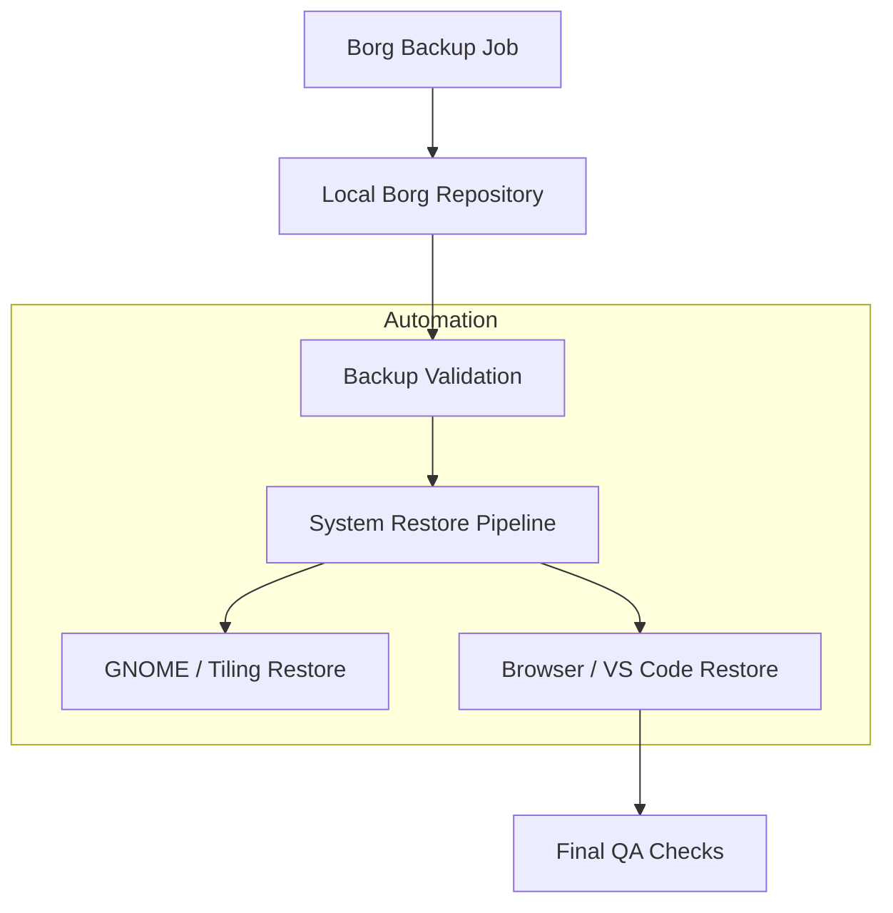

# 🧩 SRE Pipeline Architecture Diagram

### **Author: Javier Antonio Lozada — Lead SRE Architect**

---

## 📘 Overview

This diagram illustrates the **end-to-end lifecycle** of backup, validation, and workstation restoration within the SRE Laptop Restore Framework.

The objective is to ensure:

- Full reproducibility
- Minimal manual touch
- Single-source-of-truth automation
- Clear phase separation
- Observability of each component

---

