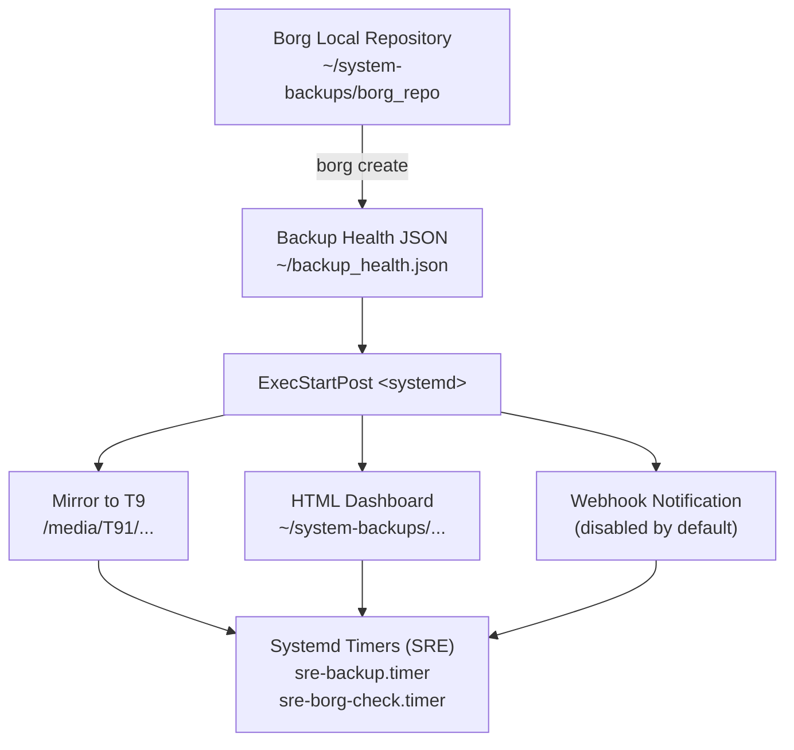

# SRE Laptop Backup System — Runbook
**Author:** Javier A. Lozada  
**Environment:** Ubuntu (ThinkPad P1 Gen 5)  
**Backup Stack:** BorgBackup + Rsync Mirror + Dashboard + Systemd Automation  

---

# 1. Purpose
This runbook documents the full backup, restore, and disaster-recovery (DR) workflow for the SRE Laptop Backup Ecosystem.  
It defines architecture, procedures, validation commands, failure scenarios, and operator guidance.

This document assumes:
- Local Borg repo lives under `~/system-backups/borg_repo`
- Samsung T9 (T91) external SSD mirrors the repo to `/media/javier/T91/system-backups-mirror`
- Systemd timers automate nightly backups and weekly integrity checks
- Dashboard located under `~/system-backups/health/backup_dashboard.html`

---

# 2. Architecture Overview



---

# 3. Components

### **3.1 Borg Local Backup**
- Encrypted repo  
- Pruning enabled  
- Key retrieval via ``

### **3.2 Samsung T9 Mirror**
Mirror path:
```bash
/media/javier/T91/system-backups-mirror
```

### **3.3 Dashboard**
Path:
```bash
~/system-backups/health/backup_dashboard.html
```

### **3.4 Systemd Timers**
Nightly backup:
```bash
sre-backup.service
sre-backup.timer
```

Weekly integrity:
```bash
sre-borg-check.service
sre-borg-check.timer
```

---

# 4. Standard Operating Procedures (SOP)

## 4.1 Run a Manual Backup
```bash
systemctl --user start sre-backup.service
systemctl --user status sre-backup.service --no-pager
```

Expected: `status=0/SUCCESS`

---

## 4.2 Validate Borg Repository
```bash
borg check ~/system-backups/borg_repo
```

Expected: **no output (clean return)**

---

## 4.3 Validate T9 Mirror
```bash
ls -lah /media/javier/T91/system-backups-mirror
```

Expected:
- `borg_repo/`
- `logs/`
- `health/`

---

## 4.4 Validate Dashboard
```bash
xdg-open ~/system-backups/health/backup_dashboard.html
```

---

## 4.5 Validate Systemd Timers
```bash
systemctl --user list-timers --all | grep -E "sre-backup|sre-borg"
```

Expected:
- `sre-backup.timer`: next run at 02:00  
- `sre-borg-check.timer`: next run Sunday 03:30  

---

# 5. Restore Procedures

## 5.1 Restore a File or Directory
```bash
borg extract ~/system-backups/borg_repo::2025-11-18-home /
```

Preview:
```bash
borg list ~/system-backups/borg_repo::2025-11-18-home
```

---

## 5.2 Restore Entire Home Directory
```bash
borg extract --progress ~/system-backups/borg_repo::latest
```

---

# 6. Disaster Recovery (DR)

## **6.1 Scenario: Laptop Lost or Fails to Boot**
Install dependencies:
```bash
sudo apt install borgbackup rsync jq
```

Mount Samsung T9:
```bash
sudo mkdir -p /media/javier/T91
sudo mount /dev/sdX1 /media/javier/T91
```

Restore Borg repo:
```bash
cp -r /media/javier/T91/system-backups-mirror/borg_repo ~/system-backups/
```

Restore home:
```bash
borg extract ~/system-backups/borg_repo::latest
```

---

## **6.2 Scenario: Borg Repo Corruption**
Recover from mirror:
```bash
rm -rf ~/system-backups/borg_repo
cp -r /media/javier/T91/system-backups-mirror/borg_repo ~/system-backups/
```

---

## **6.3 Scenario: Lost T9 Drive**
Recreate mirror:
```bash
systemctl --user start sre-backup.service
```

---

## **6.4 Scenario: Lost Borg Key**
If `` uses a file:

- Recover key file from T9 mirror  
- Or from password manager  
- Or from GitHub Secrets (future)  

---

# 7. Troubleshooting

### Backup didn’t run
```bash
journalctl --user -u sre-backup.service --no-pager
```

### T9 not detected
```bash
lsblk | grep T91
```

### Dashboard missing Borg info
Cause:
- Borg key not available non-interactively  
- `` missing in systemd env  

---

# 8. File Paths Reference
```bash
~/system-backups/borg_repo/
~/system-backups/logs/
~/system-backups/health/backup_dashboard.html
/media/javier/T91/system-backups-mirror/
~/backup_health.json
~/repos/sre-laptop-restore/
```

---

# 9. Status Overview
```bash
borg check ~/system-backups/borg_repo && ls /media/javier/T91/system-backups-mirror && systemctl --user list-timers --all
```

If all succeed → system healthy.

---

# 10. Change History
- **2025-11-18** — Full validation (Javier + ChatGPT)  
- **2025-11-18** — Dashboard active  
- **2025-11-18** — T9 mirror operational  
- **2025-11-18** — Timers verified  
